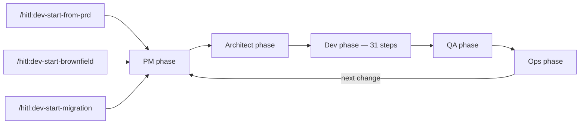
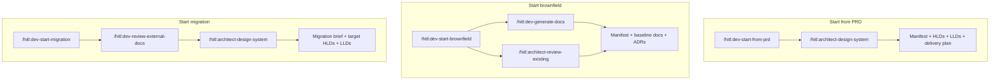
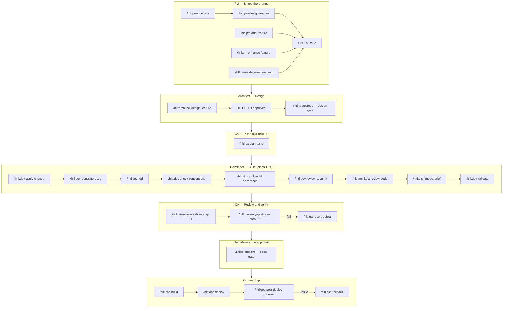
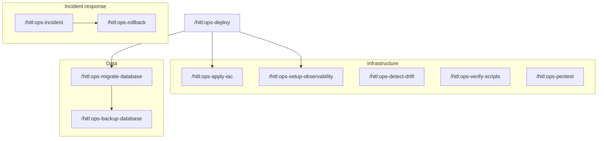

# HITL Command Map

All commands across every workflow, showing where each one appears in the delivery lifecycle.

---

## 1. Project Lifecycle — High Level

The three setup paths converge into a single repeating change loop.

---

## 2. Setup Flows

Each path produces a different starting artifact before the change loop begins.

---

## 3. Per-Change Delivery Flow

The full command sequence for a Tier 2+ change, by role.

---

## 4. Ops Command Landscape

---

## 5. Commands at a Glance

### Setup — run once

| Command | When |
|---|---|
| `/hitl:dev-start-from-prd` | New greenfield project |
| `/hitl:dev-start-brownfield` | Existing codebase |
| `/hitl:dev-start-migration` | System-to-system migration |
| `/hitl:architect-design-system` | After PRD or migration setup |
| `/hitl:architect-review-existing` | After brownfield manifest generation |
| `/hitl:dev-review-external-docs` | After migration setup, before design |

### PM — any time before a change starts

| Command | When |
|---|---|
| `/hitl:pm-design-feature` | Rough idea → structured requirement |
| `/hitl:pm-add-feature` | Add new requirement to PRD |
| `/hitl:pm-enhance-feature` | Enhance existing feature |
| `/hitl:pm-update-requirement` | Change AC, scope, or priority on existing requirement |
| `/hitl:pm-report-bug` | File a structured defect |
| `/hitl:pm-prioritize` | Backlog prioritization |
| `/hitl:pm-review-scope-change` | Impact of a proposed scope change |
| `/hitl:pm-review-progress` | Sprint or milestone progress check |
| `/hitl:pm-answer-questions` | Product questions from PRD and docs |
| `/hitl:pm-prep-demo` | Demo script and talking points |

### Architect — design phase (steps 3–9)

| Command | When |
|---|---|
| `/hitl:architect-design-feature` | Feature-level HLD + LLD with approval gates |
| `/hitl:architect-review-code` | Human code review at step 19a |

### QA — across design and implementation

| Command | Step | When |
|---|---|---|
| `/hitl:qa-plan-tests` | 7 | After LLD approval, before TDD |
| `/hitl:qa-review-tests` | 11 | After RED phase; gates implementation start |
| `/hitl:qa-verify-quality` | 22 | Post-handoff independent verification |
| `/hitl:qa-report-defect` | 22+ | When verify-quality fails |

### Developer — implementation (steps 1–25)

| Command | Step(s) | When |
|---|---|---|
| `/hitl:dev-practices` | 1 | Entry point for the 31-step workflow |
| `/hitl:dev-apply-change` | 3 | Change planning and impact analysis |
| `/hitl:dev-generate-docs` | 5–6 | HLD/LLD for a component |
| `/hitl:dev-tdd` | 10–16 | Red→Green→Refactor cycle |
| `/hitl:dev-check-conventions` | 17 | Semgrep, secrets, manifest drift, Mermaid lint |
| `/hitl:dev-review-lld-adherence` | 18 | Code vs LLD conformance check |
| `/hitl:dev-review-security` | 19 | Threat model, SAST, or security baseline |
| `/hitl:dev-impact-brief` | 23 | Downstream impact and rollout plan |
| `/hitl:dev-validate` | Any | Iterative check→fix→re-check before done |
| `/hitl:dev-conclude` | Any | Slack design thread → GitHub ADR + issue |

### Gates

| Command | When |
|---|---|
| `/hitl:ta-approve` | Advance design gate (after LLD approval) or code gate (before Ops) |

### Ops — after code gate

| Command | When |
|---|---|
| `/hitl:ops-build` | Validate and run build pipeline |
| `/hitl:ops-deploy` | Full deployment workflow |
| `/hitl:ops-plan-platform` | Platform readiness register + roadmap (onboarded → delivery-ready) |
| `/hitl:ops-apply-iac` | Infrastructure-as-code changes |
| `/hitl:ops-migrate-database` | Database migration before deploy |
| `/hitl:ops-backup-database` | Pre-deploy or scheduled backup |
| `/hitl:ops-setup-observability` | Logging, metrics, alerting |
| `/hitl:ops-verify-scripts` | Script/tooling validation |
| `/hitl:ops-post-deploy-monitor` | Post-deploy monitoring |
| `/hitl:ops-detect-drift` | Config or infrastructure drift |
| `/hitl:ops-pentest` | Penetration test workflow |
| `/hitl:ops-rollback` | Roll back a deployment |
| `/hitl:ops-incident` | P0 incident response |

### Utility — available at any time

| Command | Purpose |
|---|---|
| `/hitl:help` | Find the right command for any situation |
| `/hitl:dev-update` | Update the plugin to the latest version |
