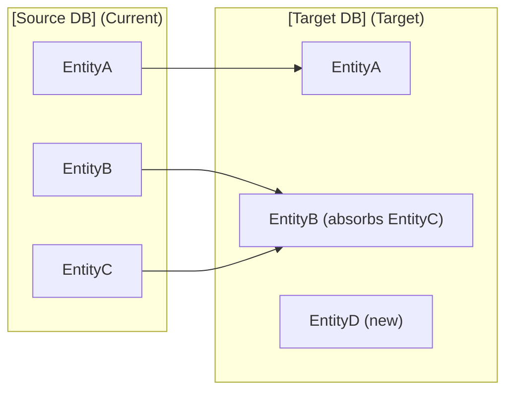

# Data Model Mapping — [Source DB] → [Target DB]

**Parent:** [Migration docs index]

---

## 1. Overview

[One paragraph describing: current DB technology, target DB technology, and why the migration is happening.]

---

## 2. Entity Mapping Summary

### Mapping decisions

| Current entity | Target entity | Change type | Notes |
|---------------|--------------|:-----------:|-------|
| EntityA | EntityA | Rename/reshape | [what changed] |
| EntityB + EntityC | EntityB | Merge | [why merged] |
| — | EntityD | New | [why added] |
| EntityE | — | Dropped | [why removed] |

---

## 3. Field-by-Field Mapping

### EntityA → EntityA

| Current field | Type (current) | Target field | Type (target) | Transform | Notes |
|--------------|---------------|-------------|--------------|-----------|-------|
| `_id` | ObjectId | `id` | UUID | Generate new UUID | PK change |
| `name` | String | `name` | VARCHAR(255) | Direct copy | |
| `created_at` | Date | `created_at` | TIMESTAMPTZ | Direct copy | |
| `nested.field` | Embedded doc | `field_json` | JSONB | Flatten or keep as JSON | Document if JSONB is temporary |
| `status` | String | `status` | ENUM | Map string values to enum | List the mapping below |

**Enum mapping for `status`:**
| Current value | Target value |
|:------------:|:-----------:|
| "active" | ACTIVE |
| "inactive" | INACTIVE |
| "archived" | ARCHIVED |

### EntityB → EntityB

[Same table structure]

---

## 4. Relationship Changes

| Current relationship | Type (current) | Target relationship | Type (target) | Notes |
|---------------------|:--------------:|-------------------|:------------:|-------|
| EntityA embeds EntityB[] | Embedded array | EntityB.entity_a_id FK | One-to-many | Extracted to separate table |
| EntityC references EntityA | DBRef / ObjectId | EntityC.entity_a_id FK | Foreign key | Same semantics, different mechanism |

---

## 5. Index Mapping

| Current index | Target index | Notes |
|--------------|-------------|-------|
| `{ email: 1 }` unique | `UNIQUE INDEX ON users(email)` | |
| `{ tenant_id: 1, created_at: -1 }` | `INDEX ON items(tenant_id, created_at DESC)` | |

---

## 6. Migration Script Requirements

For each entity migration:

| Entity | Row count (est.) | Strategy | Downtime? |
|--------|:----------------:|:--------:|:---------:|
| EntityA | ~10K | Batch copy | No — dual-write during migration |
| EntityB | ~500K | Stream copy | No — background job |
| EntityC | ~1M | Incremental | No — paginated cursor |

### Data integrity checks (post-migration)

- [ ] Row count matches: source count == target count per entity
- [ ] Referential integrity: all foreign keys resolve
- [ ] Enum mapping: no NULL values where NOT NULL expected
- [ ] Timestamp timezone: all dates in UTC
- [ ] UUID generation: no collisions, all PKs populated

---

## 7. Rollback Plan

If migration fails or data integrity checks fail:
1. [How to revert — drop target tables? Restore from backup?]
2. [What data might be lost — writes during migration window?]
3. [How long rollback takes]
