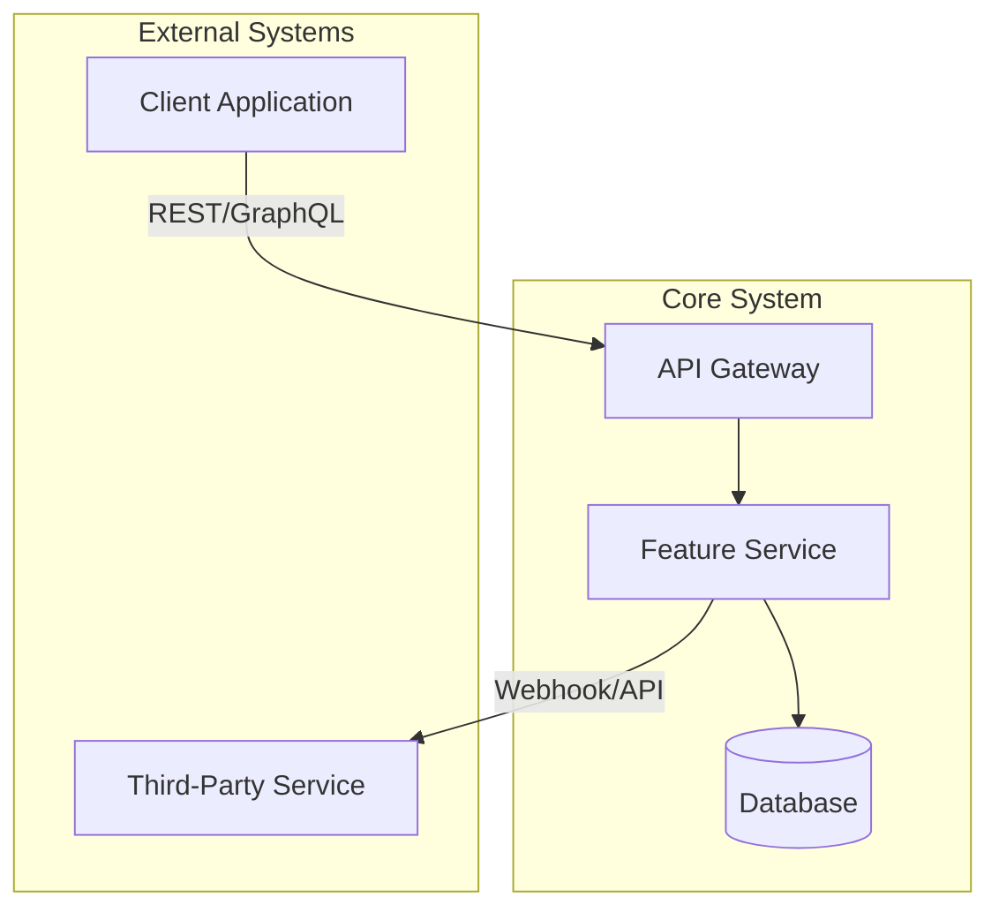
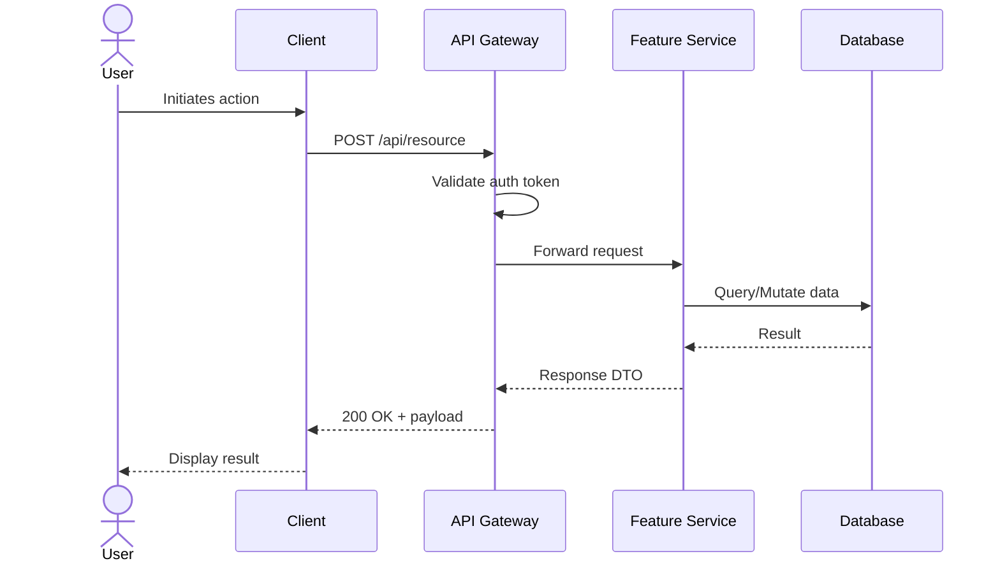
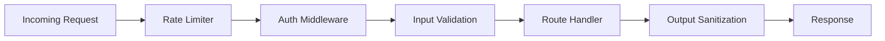

# HLD: [Feature Name]

> **Status:** Draft | Approved | Superseded
> **Author:** [Name]
> **Date:** [YYYY-MM-DD]
> **Last Updated:** [YYYY-MM-DD]

---

## 1. Executive Summary

[1-2 paragraph description of the feature/system, its purpose, and the problem it solves.]

---

## 2. System Architecture

---

## 3. Component Overview

| Component | Responsibility | Technology |
|-----------|---------------|------------|
| API Gateway | Request routing, auth validation | Express / FastAPI |
| Feature Service | Core business logic | Node.js / Python |
| Database | Data persistence | PostgreSQL / MongoDB |
| Cache Layer | Performance optimization | Redis |

---

## 4. Data Flow

---

## 5. Integration Points

| System | Direction | Protocol | Purpose |
|--------|-----------|----------|---------|
| [External Service] | Outbound | REST API | [Description] |
| [Message Queue] | Bidirectional | AMQP | [Description] |
| [Auth Provider] | Inbound | OAuth 2.0 | [Description] |

---

## 6. Security Architecture

- **Authentication:** [JWT / OAuth 2.0 / API Key]
- **Authorization:** [RBAC / ABAC / Policy-based]
- **Data Protection:** [Encryption at rest / in transit]
- **Input Validation:** [Schema validation, sanitization]
- **Rate Limiting:** [Strategy and thresholds]

---

## 7. Scalability Considerations

- **Horizontal Scaling:** [How the system scales out]
- **Caching Strategy:** [What gets cached, TTL, invalidation]
- **Database Scaling:** [Read replicas, sharding, connection pooling]
- **Async Processing:** [Queue-based workflows, background jobs]
- **Performance Targets:** [Latency, throughput, concurrency]

---

## 8. Open Questions

- [ ] [Question 1]
- [ ] [Question 2]

---

## 9. Decision Log

| Decision | Rationale | Date |
|----------|-----------|------|
| [Choice made] | [Why this was chosen over alternatives] | [Date] |
