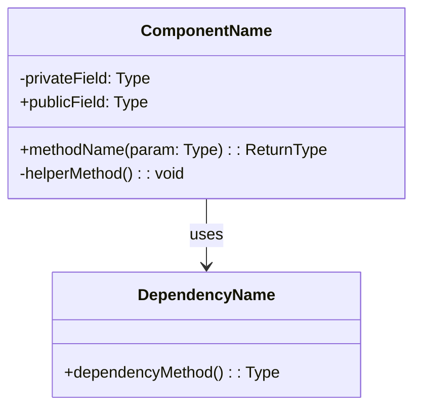
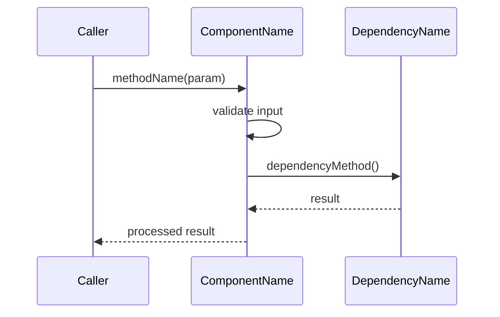

# [Component Name]

> **Package:** `[category]/[component-name]`
> **Type:** Controller | Service | Model | Security | Config
> **Related HLD:** [Link to HLD document]

---

## 1. Overview

[Brief description of this component's purpose and role in the system.]

---

## 2. Class Diagram



---

## 3. Methods

### `methodName(param: Type): ReturnType`

**Description:** [What this method does]

**Parameters:**

| Name | Type | Required | Description |
|------|------|----------|-------------|
| `param` | `Type` | Yes | [Description] |

**Returns:** `ReturnType` — [Description of return value]

**Throws:**

| Error | Condition |
|-------|-----------|
| `NotFoundError` | When resource doesn't exist |
| `ValidationError` | When input is invalid |

**Example:**
```typescript
const result = await component.methodName(param);
```

---

### `anotherMethod(): void`

[Repeat the pattern above for each public method]

---

## 4. Sequence Diagrams

### [Flow Name]



---

## 5. Data Structures

### [DTO / Interface Name]

```typescript
interface ExampleDTO {
  id: string;
  name: string;
  createdAt: Date;
  metadata?: Record<string, unknown>;
}
```

---

## 6. Configuration

| Property | Type | Default | Description |
|----------|------|---------|-------------|
| `SETTING_NAME` | `string` | `"default"` | [Description] |

---

## 7. Error Handling

| Scenario | Error Type | HTTP Status | Recovery |
|----------|-----------|-------------|----------|
| Resource not found | `NotFoundError` | 404 | Return error message |
| Invalid input | `ValidationError` | 400 | Return validation details |

---

## 8. Related Components

- **Depends on:** [`DependencyName`](../services/dependency-name.md)
- **Used by:** [`ConsumerName`](../controllers/consumer-name.md)
- **Related model:** [`ModelName`](../models/model-name.md)

<!-- NOTE: Relative paths above are placeholders. Adjust the depth to match
     your actual directory structure. For example, if this file is at
     docs/02-design/technical/lld/services/foo.md, then a reference to
     a controller would be: ../controllers/bar.md
     and a reference to a model would be: ../models/baz.md -->

---

## LLD Index Maintenance

When creating a new LLD file, also:
1. Add it to `docs/02-design/technical/lld/index.md` under the correct category
2. Add its module to `docs/02-design/technical/lld/packages.md` in the dependency diagram
3. Cross-link it from any related LLDs (both directions)

The LLD index should be organized by category:

```
lld/
├── index.md              ← Navigation + package dependency diagram
├── packages.md           ← Module hierarchy (Mermaid classDiagram)
├── controllers/          ← API endpoints, route handlers
│   ├── auth.md
│   └── products.md
├── services/             ← Business logic
│   ├── catalog.md
│   └── orders.md
├── models/               ← Data structures, entities
│   ├── user.md
│   └── product.md
├── agents/               ← Agent designs (if applicable)
│   └── framework.md
├── config/               ← Configuration components
│   └── settings.md
└── security/             ← Auth, guards, middleware
    └── jwt.md
```
