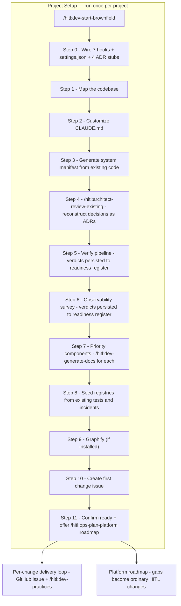
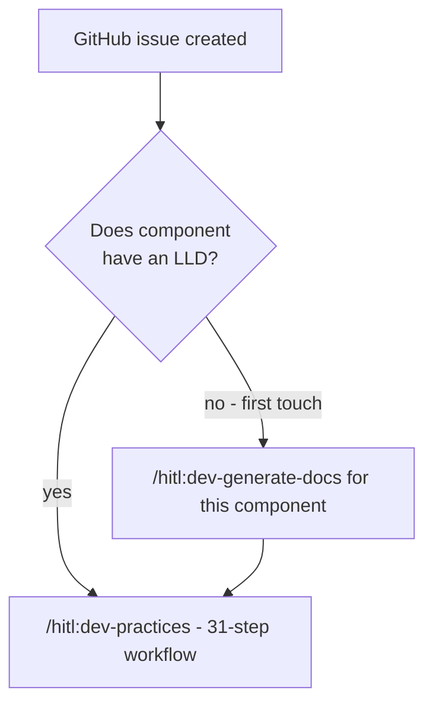
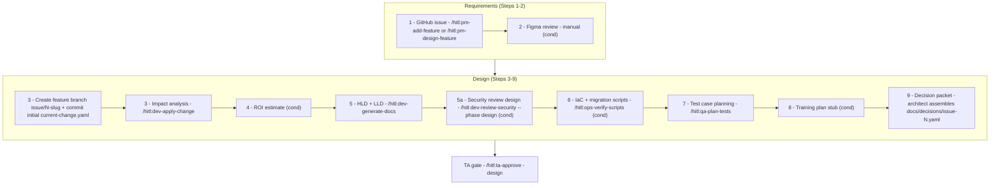
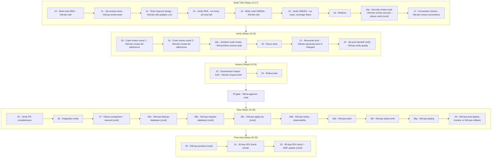

# Brownfield Workflow — End to End

All steps from onboarding an existing codebase through production delivery, following the `/hitl:dev-start-brownfield` path.

**Key difference from the PRD path:** you have existing code, so the setup phase reconstructs what is already there rather than designing from scratch. Documentation is built incrementally — only priority components get docs during setup; every other component gets its LLD the first time it is changed.

---

## 1. Project Setup

Setup ends when the system manifest, architecture ADRs, priority component LLDs, registries, and the platform readiness register all exist. No per-change work begins before that point.

### What each step produces

| Step | Command | Output | Required before |
|---|---|---|---|
| 0 | _(wires hooks automatically)_ | `.hitl/hooks/`, `.claude/settings.json`, 4 ADR stubs | Everything else |
| 1 | _(reads directory tree)_ | Confirmed source roots and tech stack | Manifest generation |
| 2 | _(fills CLAUDE.md from observed code patterns)_ | Conventions and test framework locked in | Code generation |
| 3 | `python tools/generate-manifest/generator.py` | `docs/system-manifest.yaml` (from real code) | Architecture review |
| 4 | `/hitl:architect-review-existing` | Tech stack summary, ADR-0005+ for existing decisions, concern list | Per-change work |
| 5 | _(verifies CI/CD, offers scaffold)_ | Pipeline verdicts (D1/E1/E3) in `docs/04-operations/platform-readiness.yaml` | Build/deploy steps of the 31-step workflow |
| 6 | _(surveys observability)_ | Observability verdict (F1) in the readiness register; token cost registry | First Tier 2 deploy |
| 7 | `/hitl:dev-generate-docs` (per component) | HLD + LLD for each priority component | First change to those components |
| 8 | _(scans test files + interviews team)_ | `test-registry.yaml`, `incident-registry.yaml` | `/hitl:dev-practices` step 7 |
| 9 | `graphify . && graphify hook install` | `graphify-out/graph.json` (optional) | First `/hitl:dev-practices` run |
| 10 | `gh issue create` | First tracked change issue | Per-change loop |
| 11 | _(confirms baseline)_ | Handoff to `/hitl:ops-plan-platform roadmap` — recorded gaps become phased roadmap issues; Tier 2+ **production** deploys stay blocked until the register says `delivery_ready: true` | — |

### What `/hitl:architect-review-existing` produces (Step 4)

This is the brownfield-specific step that has no equivalent in the PRD path. It reads the existing codebase and interviews the architect before any incremental work begins.

| Phase | What happens |
|---|---|
| 1 — Landscape | Reads manifest + technology indicator files; outputs Tech Stack Summary |
| 2 — Extract decisions | Identifies concrete decisions across 8 categories: service architecture, data, auth, API style, cross-domain communication, deployment, test strategy as-built, non-obvious patterns |
| 3 — Interview | Asks architect: deliberate vs inherited, rationale, constraints and regrets, unknown decisions |
| 4 — Document ADRs | Creates ADR-0005+ for significant decisions — status Accepted or Under review; never fabricates rationale |
| 5 — Surface concerns | Categorises concerns: blocks HITL compliance (🔴), address in first changes (🟡), worth noting (🟢) |
| 6 — Handoff | Lists ADRs created, key constraints, and pre-conditions for first Tier 2 change |

Architect must confirm ADRs are accurate before Step 5 begins.

---

## 2. First-Change Consideration — Docs on First Touch

This is the brownfield-specific friction that does not exist in the PRD path. Not every component has an LLD after setup — only the priority components from Step 5 do. The first time any other component is changed, its LLD must be created before the 31-step loop can proceed.

This friction decreases naturally over time as each component gets its first doc pass through real use. Once all actively-changed components have LLDs, the brownfield path behaves identically to the PRD path.

---

## 3. Per-Change Loop — Requirements and Design (Steps 1–9)

Identical to the PRD path. One GitHub issue = one delivery slice.

---

## 4. Per-Change Loop — Build, Verify, and Ship (Steps 10–32)

Identical to the PRD path.

---

## 5. Human Approval Gates

| Gate | Position | Command | Who approves |
|---|---|---|---|
| Architecture review | Step 4 of setup | _(architect reviews ADR drafts in session)_ | Architect |
| Design gate | After Step 9 | `/hitl:ta-approve` | Tech Architect |
| QA test review | Step 11 | `/hitl:qa-review-tests` | QA |
| Architect code review | Step 19a | `/hitl:architect-review-code` | Architect reviews PR on GitHub |
| QA verify | Step 22 | `/hitl:qa-verify-quality` | QA |
| Code gate | After Step 24 | `/hitl:ta-approve` | Tech Architect |

---

## 6. PRD vs Brownfield — Key Differences

| Aspect | PRD path | Brownfield path |
|---|---|---|
| Manifest origin | Designed from PRD (provisional) | Generated from existing code |
| Architecture decisions | New — architect designs them | Existing — architect reconstructs and documents them |
| LLDs at setup end | All components designed upfront | Only priority components; others generated on first touch |
| First-change friction | None — LLDs exist | May need `dev-generate-docs` before `dev-practices` |
| Registries at setup end | Empty stubs | Seeded from real test files and past incidents |
| ADRs at setup end | 4 default stubs (ADR-0001 to 0004) | 4 default stubs + ADR-0005+ for real existing decisions |
| Per-change loop | Identical | Identical (once LLD exists) |
