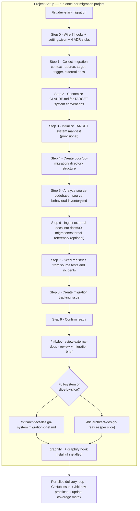
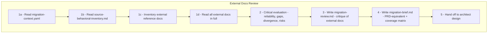
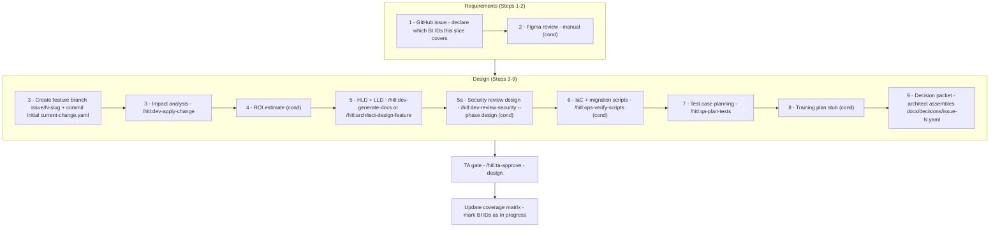
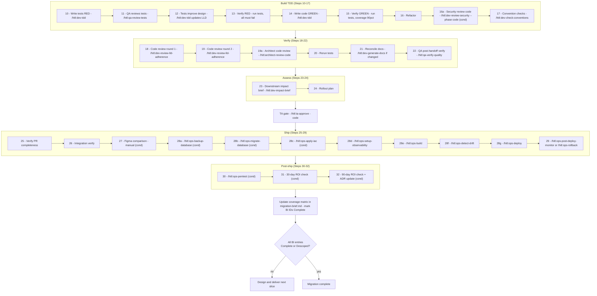

# Migration Workflow — End to End

All steps from initialising a migration project through production delivery, following the `/hitl:dev-start-migration` path.

**Key difference from PRD and brownfield paths:** migration is not brownfield. In brownfield you work *inside* the existing codebase — it is the live product. In migration the source codebase is being *replaced*: it is read-only reference. Only behaviors transfer to the target, never code. The behavioral inventory (`docs/00-migration/source-behavioral-inventory.md`) is the only bridge: each BI-NNN entry describes what the target must do; how it does it is a fresh design decision. Migration is complete when every BI entry is marked `Complete` or `Descoped` in the coverage matrix.

---

## 1. Project Setup

Setup ends when the migration brief is approved and architect design begins. No per-slice development starts before that point.

### What each setup step produces

| Step | Command | Output | Required before |
|---|---|---|---|
| 0 | _(wires hooks automatically)_ | `.hitl/hooks/`, `.claude/settings.json`, 4 ADR stubs | Everything else |
| 1 | _(collects context)_ | `docs/00-migration/migration-context.yaml` | All subsequent steps |
| 2 | _(fills CLAUDE.md for target)_ | Target-system conventions locked in | Code generation |
| 3 | _(drafts target manifest)_ | `docs/system-manifest.yaml` (provisional, for target) | Architect design |
| 4 | _(creates directory structure)_ | `docs/00-migration/` with stubs for all migration docs | Steps 5–6 |
| 5 | _(reads source code)_ | `docs/00-migration/source-behavioral-inventory.md` (BI-NNN entries) | Migration brief |
| 6 | _(copies or links external docs)_ | `docs/00-migration/external-reference/` | Review phase |
| 7 | _(scans source tests + interviews team)_ | `test-registry.yaml`, `incident-registry.yaml` (incidents flagged `migration_regression: true`) | `/hitl:dev-practices` step 7 |
| 8 | `gh issue create` | Migration tracking issue | Per-slice loop |
| 9 | _(confirms ready)_ | — | — |
| Review | `/hitl:dev-review-external-docs` | `migration-review.md` + `migration-brief.md` with coverage matrix | Architect design |
| Design | `/hitl:architect-design-system` or `/hitl:architect-design-feature` | HLDs, LLDs, `docs/decisions/` per slice | Per-slice loop |
| Graphify | `graphify . && graphify hook install` | `graphify-out/graph.json` (optional) | First `/hitl:dev-practices` run |

---

## 2. External Docs Review Phase — `/hitl:dev-review-external-docs`

This phase has no equivalent in the PRD or brownfield paths. It produces two documents that gate all design work.

| Output | Purpose | Approval required |
|---|---|---|
| `docs/00-migration/migration-review.md` | Critiques external docs: reliable inputs, gaps, divergences, risk flags | Architect must approve before brief is written |
| `docs/00-migration/migration-brief.md` | PRD-equivalent requirements for target, including behavior coverage matrix keyed to BI IDs | Architect must approve before design begins |

The **behavior coverage matrix** in the migration brief is the live definition of migration progress:

| BI ID | Behavior | Domain | Target slice | Status |
|---|---|---|---|---|
| BI-001 | _(from inventory)_ | _(domain)_ | TBD | Not started |

Status values: `Not started` / `In progress` / `Complete` / `Descoped`

`Descoped` requires an explicit architect decision. No BI entry may be silently dropped.

---

## 3. Slice Design Paths

After the migration brief is approved, the architect chooses one of two design paths. Both produce the same inputs for the per-slice delivery loop.

| Path | Command | When to use |
|---|---|---|
| Full-system | `/hitl:architect-design-system docs/00-migration/migration-brief.md` | Migrating the entire target system before any slice ships; all HLDs and LLDs designed upfront |
| Slice-by-slice | `/hitl:architect-design-feature` (per slice) | Migrating one domain at a time into an existing or partially-built target; each slice is designed just before its development begins |

**Slice criterion for both paths:** every slice must be **observable** — either user-visible (PM can demo it) or verifiable by ops/QA (record counts, data consistency checks, performance comparison). "Data migrated but not yet accessible" does not pass.

---

## 4. Per-Slice Delivery Loop — Requirements and Design (Steps 1–9)

Each slice is one GitHub issue. The migration brief replaces the PRD — reference it as `docs/00-migration/migration-brief.md` wherever a skill asks for the PRD path.

**Migration-specific rule for Step 1:** the GitHub issue body must list which BI IDs from the behavioral inventory this slice covers. This is how the coverage matrix is kept up to date.

---

## 5. Per-Slice Delivery Loop — Build, Verify, and Ship (Steps 10–32)

Identical to the PRD and brownfield paths. After the slice ships, update the coverage matrix.

---

## 6. Human Approval Gates

| Gate | Position | Command | Who approves |
|---|---|---|---|
| Migration review | After Phase 3 of `dev-review-external-docs` | _(architect reviews draft in session)_ | Architect |
| Migration brief | After Phase 4 of `dev-review-external-docs` | _(architect approves in session)_ | Architect |
| Design gate | After Step 9 of each slice | `/hitl:ta-approve` | Tech Architect |
| QA test review | Step 11 | `/hitl:qa-review-tests` | QA |
| Architect code review | Step 19a | `/hitl:architect-review-code` | Architect reviews PR on GitHub |
| QA verify | Step 22 | `/hitl:qa-verify-quality` | QA |
| Code gate | After Step 24 | `/hitl:ta-approve` | Tech Architect |

---

## 7. All Three Paths — Comparison

| Aspect | PRD | Brownfield | Migration |
|---|---|---|---|
| What exists at start | Nothing | Working source code | Working source code + target to build |
| Manifest represents | Target system (designed from PRD) | Existing system (generated from code) | Target system (designed from brief) |
| Source of requirements | `docs/01-product/prd.md` | Existing code + team knowledge | `docs/00-migration/migration-brief.md` |
| Architecture decisions | New — architect designs them | Existing — architect reconstructs as ADRs | New (target) + existing (source) reconstructed in behavioral inventory |
| LLDs at setup end | All components designed upfront | Only priority components | All (full-system) or per-slice (slice-by-slice) |
| Definition of done | Product backlog cleared | Backlog cleared | All BI entries in coverage matrix are Complete or Descoped |
| Source incidents in registry | N/A | Past production incidents | Source incidents flagged `migration_regression: true` |
| Per-change unit | Feature or bug fix | Feature or bug fix | Observable migration slice |
| Slice must be | — | — | User-visible or verifiable by ops/QA |
| Coverage tracking | None | None | BI coverage matrix in migration-brief.md, updated per slice |
