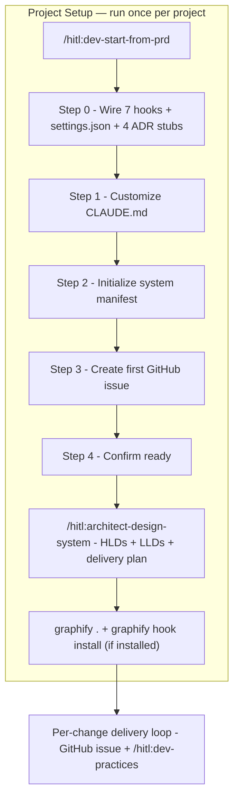
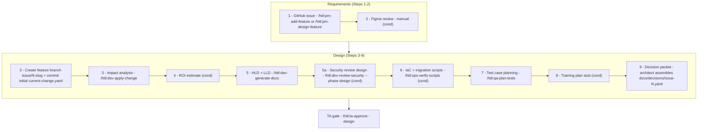
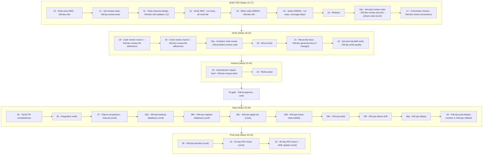

# PRD Workflow — End to End

All steps from project creation to production, following the `/hitl:dev-start-from-prd` path. Each node shows the HITL command that executes that step. Steps marked `(cond)` are conditional based on change tier or project configuration.

---

## 1. Project Setup

Setup ends when `/hitl:architect-design-system` produces approved HLDs, LLDs, and a delivery plan. No per-change work begins before that point.

### What each step produces

| Step | Command | Output | Required before |
|---|---|---|---|
| 0 | _(wires hooks automatically)_ | `.hitl/hooks/`, `.claude/settings.json`, 4 ADR stubs | Everything else |
| 1 | _(fills CLAUDE.md)_ | Conventions and test framework locked in | Code generation |
| 2 | _(drafts manifest)_ | `docs/system-manifest.yaml` (provisional) | Architect design |
| 3 | `gh issue create` | First GitHub issue | Delivery plan |
| 4 | _(confirms ready)_ | — | — |
| Design | `/hitl:architect-design-system` | HLDs, LLDs, `docs/decisions/issue-N.yaml` per slice | Per-change loop |
| Graphify | `graphify . && graphify hook install` | `graphify-out/graph.json` (optional) | First `/hitl:dev-practices` run |

---

## 2. Per-Change Loop — Requirements and Design (Steps 1–9)

One GitHub issue = one delivery slice. These steps run before any code is written.

---

## 3. Per-Change Loop — Build, Verify, and Ship (Steps 10–32)

---

## 4. Human Approval Gates

These are points where work stops until a human explicitly approves before proceeding.

| Gate | Position | Command | Who approves |
|---|---|---|---|
| Design gate | After Step 9 (decision packet) | `/hitl:ta-approve` | Tech Architect |
| QA test review | Step 11 | `/hitl:qa-review-tests` | QA |
| Architect code review | Step 19a | `/hitl:architect-review-code` | Architect reviews PR on GitHub |
| QA verify | Step 22 | `/hitl:qa-verify-quality` | QA |
| Code gate | After Step 24 (rollout plan) | `/hitl:ta-approve` | Tech Architect |

---

## 5. Full Command Reference

| Step | Command | Phase |
|---|---|---|
| 1 | `/hitl:pm-add-feature` or `/hitl:pm-design-feature` or `/hitl:pm-report-bug` | Requirements |
| 3 | `/hitl:dev-apply-change` | Design |
| 5 | `/hitl:dev-generate-docs` | Design |
| 5a | `/hitl:dev-review-security --phase design` (cond) | Design |
| 6 | `/hitl:ops-verify-scripts` (cond) | Design |
| 7 | `/hitl:qa-plan-tests` | Design |
| — | `/hitl:ta-approve` — design gate | Gate |
| 10 | `/hitl:dev-tdd` — write RED tests | Build |
| 11 | `/hitl:qa-review-tests` | Build |
| 12 | `/hitl:dev-tdd` — update LLD | Build |
| 14 | `/hitl:dev-tdd` — write GREEN code | Build |
| 16 | `/hitl:dev-tdd` — refactor | Build |
| 16a | `/hitl:dev-review-security --phase code` (cond) | Build |
| 17 | `/hitl:dev-check-conventions` | Build |
| 18 | `/hitl:dev-review-lld-adherence` — impl vs LLD | Verify |
| 19 | `/hitl:dev-review-lld-adherence` — impl vs tests | Verify |
| 19a | `/hitl:architect-review-code` | Verify |
| 21 | `/hitl:dev-generate-docs` (if design changed) | Verify |
| 22 | `/hitl:qa-verify-quality` | Verify |
| 23 | `/hitl:dev-impact-brief` | Assess |
| — | `/hitl:ta-approve` — code gate | Gate |
| 28a | `/hitl:ops-backup-database` (cond) | Ship |
| 28b | `/hitl:ops-migrate-database` (cond) | Ship |
| 28c | `/hitl:ops-apply-iac` (cond) | Ship |
| 28d | `/hitl:ops-setup-observability` | Ship |
| 28e | `/hitl:ops-build` | Ship |
| 28f | `/hitl:ops-detect-drift` | Ship |
| 28g | `/hitl:ops-deploy` | Ship |
| 29 | `/hitl:ops-post-deploy-monitor` or `/hitl:ops-rollback` | Ship |
| 30 | `/hitl:ops-pentest` (cond) | Post-ship |
